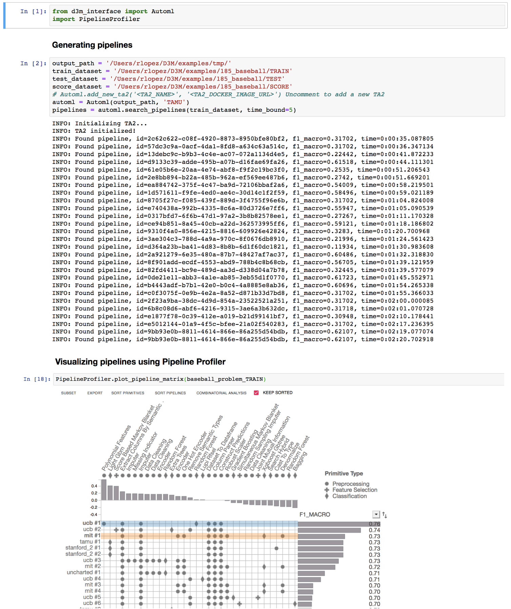
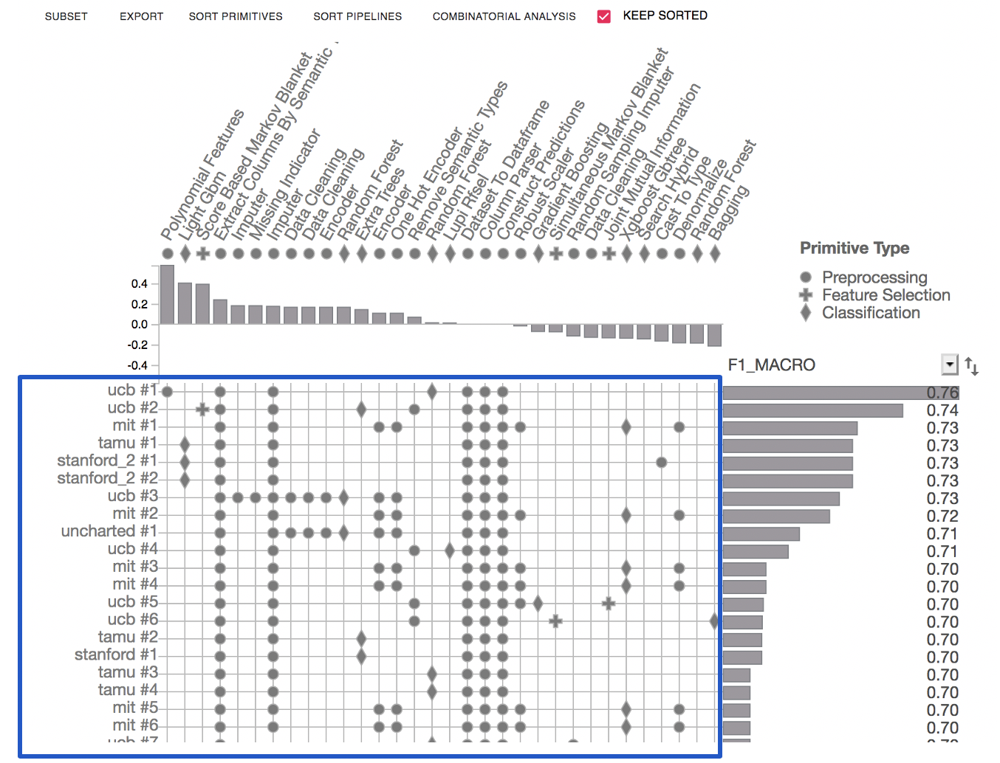
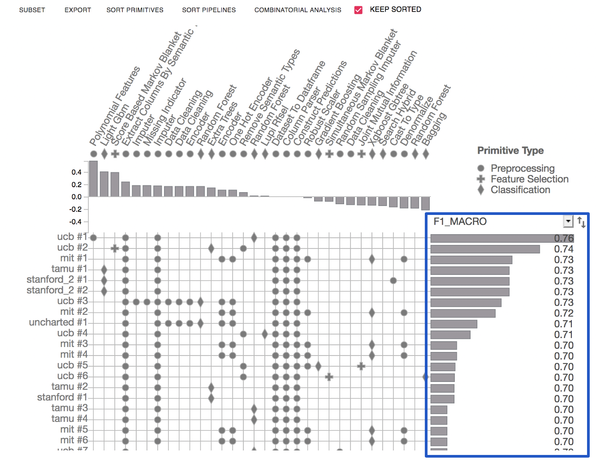
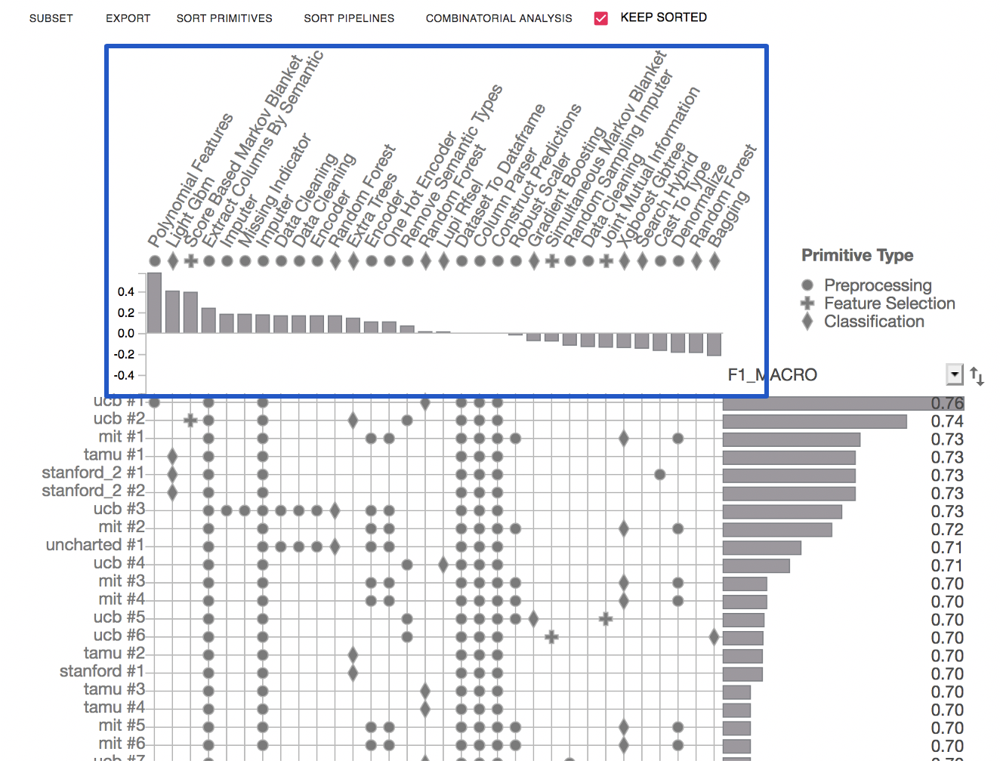
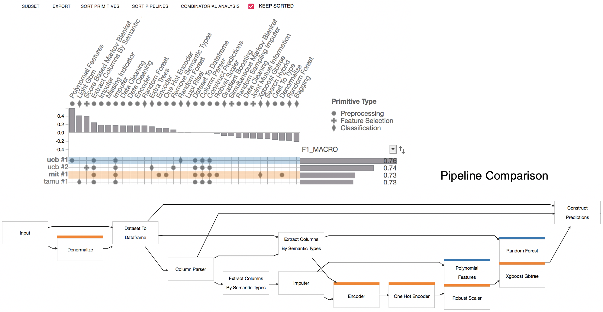

Getting started
===============

D3M Interface integrates D3M TA2 systems with Jupyter Notebooks using the TA3-TA2 API.
The Jupyter notebook provide an interactive computing environment where you can generate models using the TA2 systems, and explore them using PipelineProfiler which is an interactive visualization aimed at producing detailed visualizations of end-to-end machine learning pipelines.

    D3M Interface in a Jupyter Notebook

Model Generation
----------------

Import required libraries::

    from d3m_interface import Automl
    import PipelineProfiler

Searching pipelines::

    output_path = './D3M/examples/tmp/'
    train_dataset = './D3M/examples/185_baseball/TRAIN'
    test_dataset = './D3M/examples/185_baseball/TEST'
    score_dataset = './D3M/examples/185_baseball/SCORE'
    # Automl.add_new_ta2('<TA2_NAME>', '<TA2_DOCKER_IMAGE_URL>') Uncomment to add a new TA2
    automl = Automl(output_path, 'TAMU')
    pipelines = automl.search_pipelines(train_dataset, time_bound=5)

Display leaderboard::

    automl.leaderboard

Training, testing and scoring pipelines::

    # training
    model = automl.train('9bb93e0b-8811-4614-866e-86a255d54bdb')

    # testing
    predictions = automl.test(model, test_dataset)
    predictions

    # scoring
    automl.score('9bb93e0b-8811-4614-866e-86a255d54bdb', score_dataset)

Model Exploration
------------------

D3M Interface uses `PipelineProfiler <https://pypi.org/project/pipelineprofiler/>`__ to compare and explore the pipelines generated by the AutoML systems. PipelineProfiler produces detailed visualizations of end-to-end machine learning pipelines. It is integrated with Python Notebooks (Jupyter and Google Colab), and can be used within the data science workflow.

Given the trained models produced by TA2 systems, we can use PipelineProfiler with just two lines of code::

    # To create profiler inputs based on the generated pipelines
    profiler_inputs = automl.create_profiler_inputs()
    

    # Python api call to generated the interactive visualization
    PipelineProfiler.plot_pipeline_matrix(profiler_inputs)

Pipeline Analysis through PipelineProfiler
^^^^^^^^^^^^^^^^^^^^^^^^^^^^^^^^^^^^^^^^^^

Pipeline Matrix view shows the pipelines as rows, and the primitives as columns.

Score view displays performance metrics (i.e. accuracy, F1) of the evaluated pipelines. It can also visualize the training time of each of the pipelines.

Primitive Contribution view shows the correlation of primitive usage with the pipeline scores.

Pipeline Comparison view highlights the differences among selected pipelines. It presents a node-link representation of the selected pipelines (multiple pipelines can be selected by shift-clicking).

There is more information about how to use PipelineProfiler `here <https://towardsdatascience.com/exploring-auto-sklearn-models-with-pipelineprofiler-5b2c54136044>`__.

