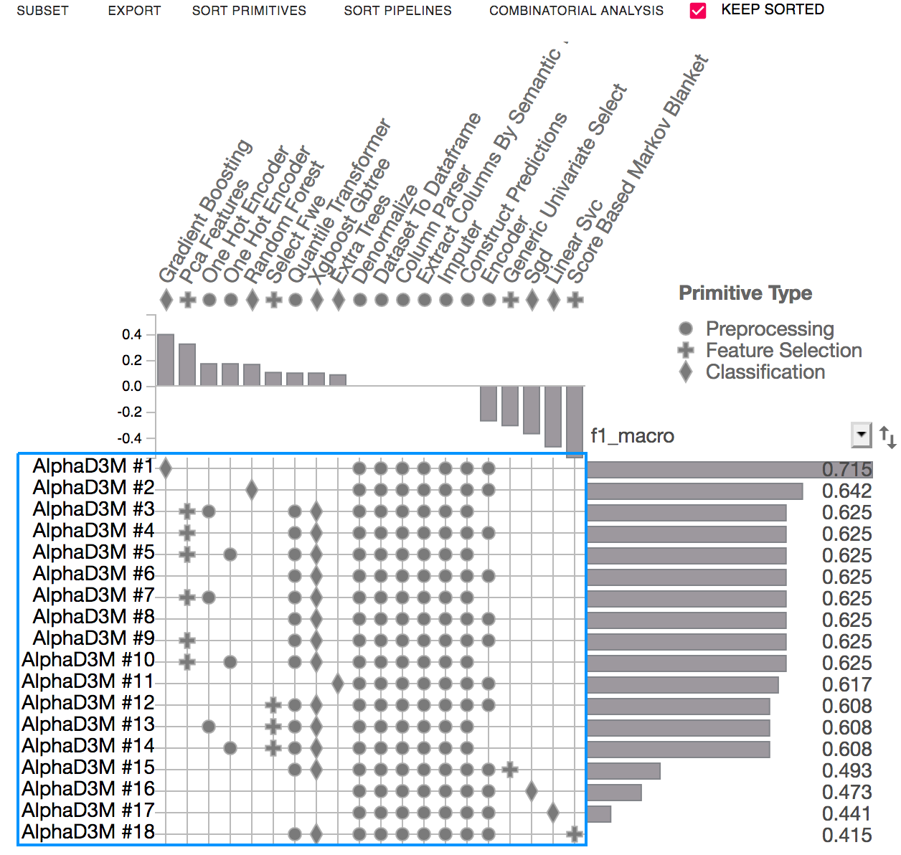
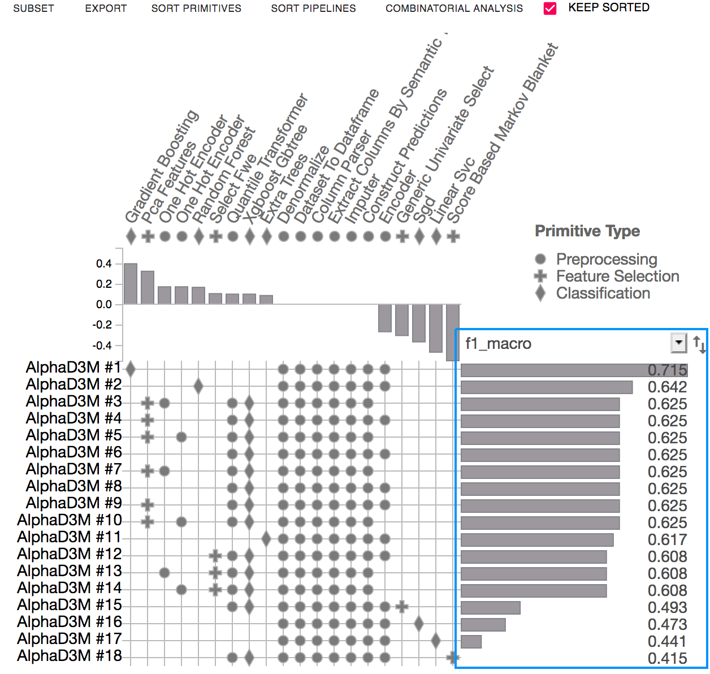
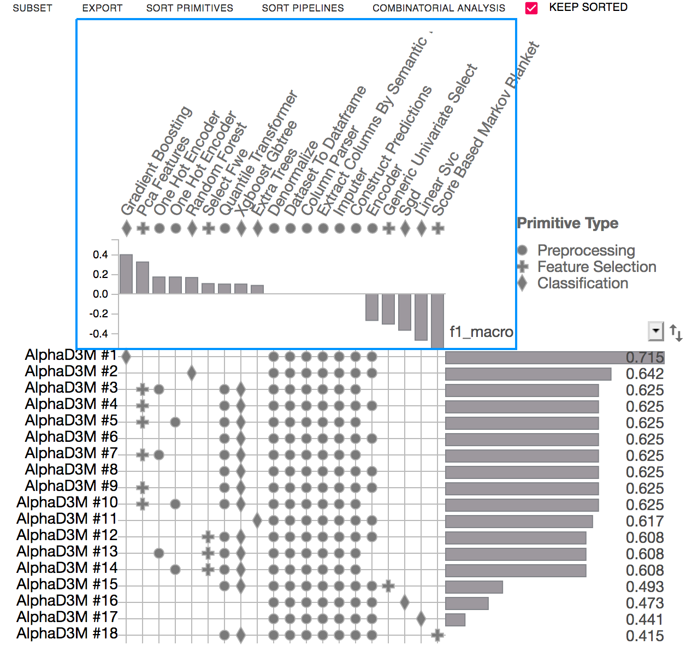
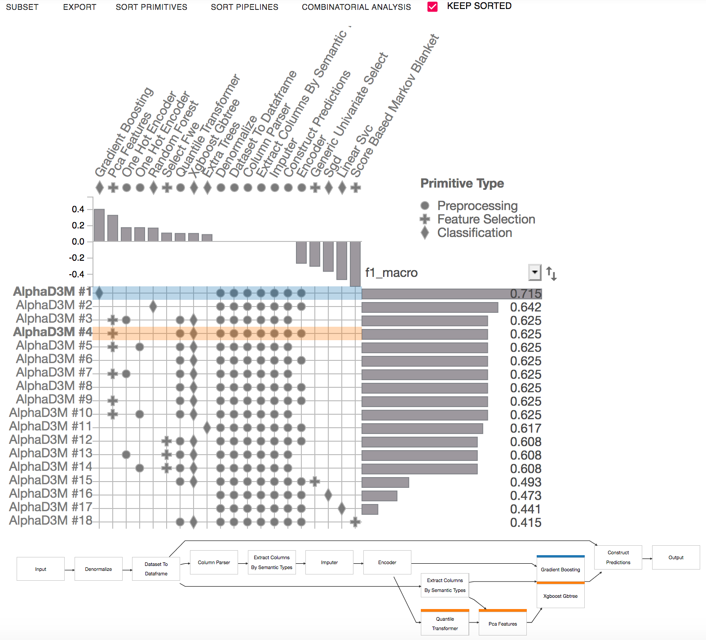

Getting started
===============

`d3m-interface` integrates D3M AutoML systems with Jupyter Notebooks.
The Jupyter notebooks provide an interactive computing environment where you can generate models using the D3M AutoML systems, and explore them using `PipelineProfiler <https://pypi.org/project/pipelineprofiler/>`__  which is an interactive visualization aimed at producing detailed visualizations of end-to-end machine learning pipelines.
`d3m-interface` has two main components: model generation and model exploration.

..  figure:: images/d3m_interface_generation.png
    :align: center

    ..

..  figure:: images/d3m_interface_exploration.png
    :align: center

    `d3m-interface` in a Jupyter Notebook

Model Generation
----------------
The model generation component provides methods to search, train, test, and score pipelines.

Import required library:

.. code-block:: python

    from d3m_interface import Automl

Searching pipelines:

.. code-block:: python

    output_path = '/D3M/examples/tmp/'
    train_dataset = '/D3M/examples/185_baseball/TRAIN'
    test_dataset = '/D3M/examples/185_baseball/TEST'
    score_dataset = '/D3M/examples/185_baseball/SCORE'
    automl = Automl(output_path, 'NYU')
    pipelines = automl.search_pipelines(train_dataset, time_bound=5)

Displaying the leaderboard:

.. code-block:: python

    automl.leaderboard

Training, testing and scoring pipelines:

.. code-block:: python

    # Training the pipeline
    model = automl.train('b5eb4cd6-19a8-4625-ae11-aa36e0fdb1c4')

    # Testing the pipeline
    predictions = automl.test(model, test_dataset)
    predictions

    # Scoring the pipeline
    automl.score('b5eb4cd6-19a8-4625-ae11-aa36e0fdb1c4', score_dataset)

Model Exploration
------------------

The model exploration component uses PipelineProfiler to compare and explore the pipelines generated by the AutoML systems.

After the pipeline search process, we can use PipelineProfiler with just one line of code:

.. code-block:: python

    automl.plot_comparison_pipelines()

Pipeline Matrix view shows the pipelines as rows, and the primitives as columns.

Score view displays performance metrics (i.e. accuracy, F1) of the evaluated pipelines. It can also visualize the training time of each of the pipelines.

Primitive Contribution view shows the correlation of primitive usage with the pipeline scores.

Pipeline Comparison view highlights the differences among selected pipelines. It presents a node-link representation of the selected pipelines (multiple pipelines can be selected by shift-clicking).

There is more information about how to use PipelineProfiler `here <https://towardsdatascience.com/exploring-auto-sklearn-models-with-pipelineprofiler-5b2c54136044>`__.

Examples
---------

You can find Jupyter notebook examples about how to use `d3m-interface` in our `repository <https://gitlab.com/ViDA-NYU/d3m/d3m_interface/-/tree/master/examples>`__.

