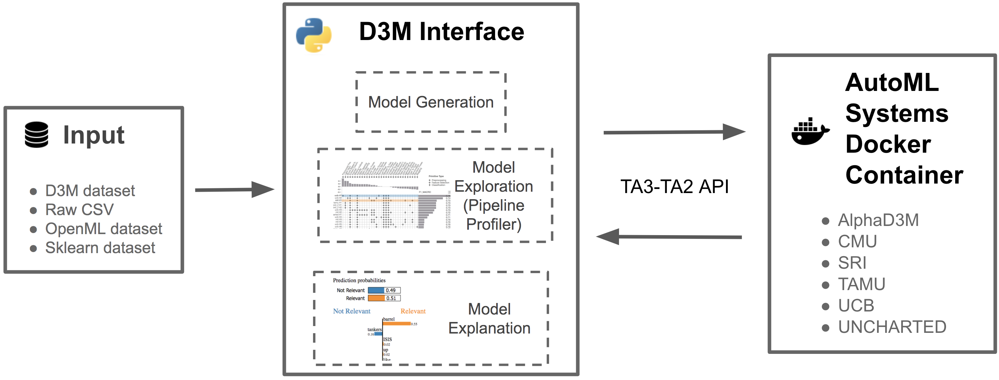

.. D3M Interface documentation master file, created by
   sphinx-quickstart on Wed Jul  8 10:30:30 2020.
   You can adapt this file completely to your liking, but it should at least
   contain the root `toctree` directive.

Welcome to D3M Interface's documentation!
=========================================

`d3m-interface` is a Python library which enable data scientist to use D3M AutoML systems.
It contains an implementation to integrate D3M AutoML systems with Jupyter Notebooks.
It provides a familiar interface, that is similar to other AutoML systems like H2O and TPOT, to make easier for people to adopt D3M tools.
 
`d3m-interface` allows data scientists to explore, understand, and build trust on the derived models. This allows them to make an informed decision regarding which model to choose, as well as to improve and customize the solution. `d3m-interface` supports six D3M AutoML systems: AlphaD3M (NYU), CMU, SRI, TAMU, UC Berkeley and UNCHARTED.

    Overall architecture of D3M Interface

You can find the source code on GitLab: https://gitlab.com/ViDA-NYU/d3m/d3m_interface

.. toctree::
   :maxdepth: 2
   :caption: Contents:

   installation
   getting-started
   how-to
   examples
   api

Indices and tables
==================

* :ref:`genindex`
* :ref:`modindex`
* :ref:`search`
